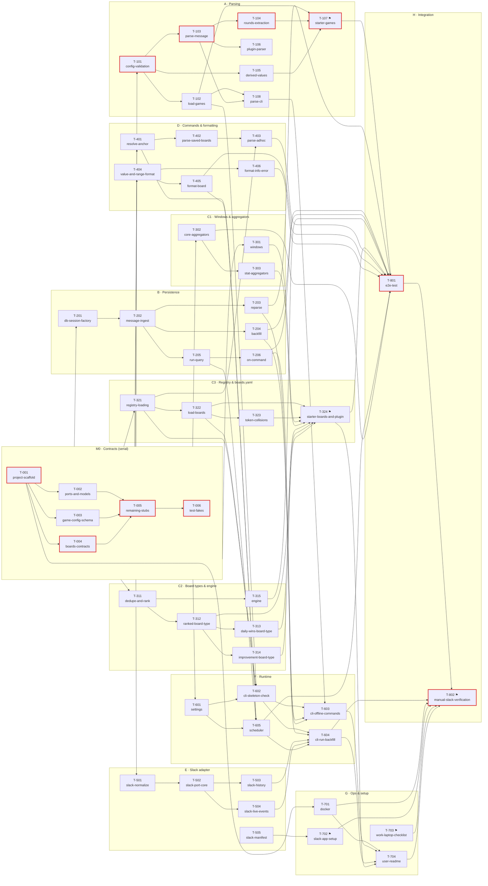

# Tickets — Overview

The build plan in [`docs/plan/`](../plan/README.md), broken into **54 small tickets**. Each
ticket is 1–3 days of work, lists the exact files it may touch, and says which tickets must be
merged before it can start. Once the contracts milestone (**M0**) is merged, up to **13 tickets
can be in progress at the same time**.

## How to pick up a ticket

1. Choose a ticket in **Todo** whose **Depends on** tickets are all **Done**. The [waves](#waves)
   table shows what can run at the same time, and the [lanes](#suggested-lanes) keep work that
   touches the same files with the same person.
2. Put your name in the [tracker](#tracker) and set the status to **In progress** (commit and push that
   straight away, so nobody else picks it up).
3. Read the ticket's **Read first** links, [`00-contracts.md`](../plan/00-contracts.md) and the
   [working rules](../plan/README.md#working-rules).
4. Work on `master` (there are no ticket branches). Only edit the files the ticket lists.
5. Where a dependency from another workstream isn't merged yet, code against the **contract stub**
   and use a monkeypatched stand-in in tests. Tickets say where this applies.
6. Commit straight to `master` with a message starting `T-<nnn>: <title>`. Run `uv run pytest`,
   then `git pull --rebase`, then push. It's **Done** when every acceptance-criteria box is ticked
   and pushed. Set the tracker status in the same commit.

**Legend:** ⚑ = needs input or action from the project owner. **S** = up to 1 day, **M** = 1–3 days.

## Milestones

| Milestone | Tickets | Outcome |
|---|---|---|
| **M0 · Contracts** | T-001 → T-006 | Every shared interface exists as a stub, with test fakes. **Unblocks all component work.** Mostly serial; T-002, T-003 and T-004 can run in parallel. |
| **M1 · Components** | T-101–T-108, T-201–T-206, T-301–T-324, T-401–T-406, T-501–T-505 | Parsing, storage, the leaderboard engine, commands and formatting, and the Slack adapter, each unit-tested with fakes. |
| **M2 · Runtime** | T-601–T-605, T-701 | A runnable `leaderboard` CLI, the scheduler and Docker. The bot can be started locally. |
| **M3 · Launch** | T-702–T-704, T-801, T-802 | The Slack app is installed, the README is written, the end-to-end test passes, and the bot is verified in the real channel. |

Tickets T-505 (manifest), T-703 (IT checklist) and T-701/T-702 (Docker, Slack app) don't depend
on the contracts. **Start them on day 1**, alongside M0.

## Dependency graph

The critical path is outlined in red. Every component ticket depends on M0 (merging T-006); that's
drawn as a single `M0 →` edge.

## Critical path

[T-001](T-001-project-scaffold.md) → [T-004](T-004-boards-contracts.md) → [T-005](T-005-remaining-stubs.md) → [T-006](T-006-test-fakes.md) → [T-101](T-101-config-validation.md) → [T-103](T-103-parse-message.md) → [T-104](T-104-rounds-extraction.md) → [T-107](T-107-starter-games.md) → [T-801](T-801-e2e-test.md) → [T-802](T-802-manual-slack-verification.md)

That's about **15 engineer-days** end to end, even with unlimited people. The things
that most affect the finish date:

1. **M0 must be fast and well reviewed.** Everything waits on it, and contract changes later are
   expensive. Put your strongest engineer on T-004 and T-005.
2. **Real game share texts (T-107 ⚑)** are on the critical path. Ask the project owner for them
   **on day 1**, so T-107 isn't waiting when T-104 lands.
3. **T-702 (Slack app ⚑) and T-703 (IT checklist ⚑)** can take days of admin or IT turnaround.
   Start them on day 1.

## Waves

A ticket's wave is the earliest point it can start, if everything before it finishes on time.
Tickets in the same wave can run in parallel.

| Wave | Tickets |
|---|---|
| 0 | [T-001](T-001-project-scaffold.md), [T-505](T-505-slack-manifest.md), [T-703](T-703-work-laptop-checklist.md) |
| 1 | [T-002](T-002-ports-and-models.md), [T-003](T-003-game-config-schema.md), [T-004](T-004-boards-contracts.md), [T-701](T-701-docker.md), [T-702](T-702-slack-app-setup.md) |
| 2 | [T-005](T-005-remaining-stubs.md) |
| 3 | [T-006](T-006-test-fakes.md) |
| 4 | [T-101](T-101-config-validation.md), [T-201](T-201-db-session-factory.md), [T-301](T-301-windows.md), [T-302](T-302-core-aggregators.md), [T-311](T-311-dedupe-and-rank.md), [T-321](T-321-registry-loading.md), [T-401](T-401-resolve-anchor.md), [T-404](T-404-value-and-range-format.md), [T-501](T-501-slack-normalize.md), [T-601](T-601-settings.md) |
| 5 | [T-102](T-102-load-games.md), [T-103](T-103-parse-message.md), [T-105](T-105-derived-values.md), [T-202](T-202-message-ingest.md), [T-303](T-303-stat-aggregators.md), [T-312](T-312-ranked-board-type.md), [T-315](T-315-engine.md), [T-322](T-322-load-boards.md), [T-402](T-402-parse-saved-boards.md), [T-405](T-405-format-board.md), [T-406](T-406-format-info-error.md), [T-502](T-502-slack-port-core.md) |
| 6 | [T-104](T-104-rounds-extraction.md), [T-106](T-106-plugin-parser.md), [T-108](T-108-parse-cli.md), [T-203](T-203-reparse.md), [T-204](T-204-backfill.md), [T-205](T-205-run-query.md), [T-313](T-313-daily-wins-board-type.md), [T-314](T-314-improvement-board-type.md), [T-323](T-323-token-collisions.md), [T-403](T-403-parse-adhoc.md), [T-503](T-503-slack-history.md), [T-504](T-504-slack-live-events.md), [T-602](T-602-cli-skeleton-check.md) |
| 7 | [T-107](T-107-starter-games.md), [T-206](T-206-on-command.md), [T-324](T-324-starter-boards-and-plugin.md), [T-605](T-605-scheduler.md) |
| 8 | [T-603](T-603-cli-offline-commands.md), [T-604](T-604-cli-run-backfill.md), [T-801](T-801-e2e-test.md) |
| 9 | [T-704](T-704-user-readme.md) |
| 10 | [T-802](T-802-manual-slack-verification.md) |

## Suggested lanes

A lane is a sequence of tickets that share files, so one person owning the lane avoids merge
conflicts. With **7 engineers** after M0:

| Lane | Engineer | Tickets (in order) | Notes |
|---|---|---|---|
| Contracts | #1 (lead) | T-001 → T-002 / T-003 / T-004 → T-005 → T-006 | #2 and #3 can take T-002 and T-003 in parallel with #1 on T-004. |
| Parsing | #2 | T-101 → T-105 → T-102 → T-103 → T-104 → T-106 → T-108 → T-107 ⚑ | Owns `config.py` and `parser.py`. |
| Persistence | #3 | T-201 → T-202 → T-203 → T-204 → T-205 → T-206 | Owns `db.py` and `service.py`. |
| Windows & aggregators, then registry | #4 | T-301 → T-302 → T-303 → T-321 → T-322 → T-323 → T-324 ⚑ | C1 then C3. |
| Board types & engine | #5 | T-311 → T-312 → T-313 → T-314 → T-315 | Owns `core.py` bodies, `types.py` and `engine.py`. |
| Commands & formatting | #6 | T-401 → T-404 → T-405 → T-406 → T-402 → T-403 | Owns `commands.py` and `formatting.py`. |
| Slack & ops | #7 | T-505, T-701, T-702 ⚑, T-703 ⚑ (day 1) → T-501 → T-502 → T-503 → T-504 | Owns `adapters/slack.py` and the Docker files. |
| Runtime & launch | whoever frees up first (likely #3 or #6) | T-601 → T-605 → T-602 → T-603 → T-604 → T-704 → T-801 → T-802 ⚑ | Owns `settings.py`, `scheduler.py` and `cli.py`. |

**With fewer people:** merge lanes along workstream lines, e.g. Parsing + Persistence,
Windows/Registry + Board types, Commands + Slack. The order within each lane stays the same.

**Tickets that share a file** (keep them in one lane, or expect small merges):
`config.py` T-101/T-102/T-105 · `parser.py` T-103/T-104/T-106 · `service.py` T-202–T-206 ·
`aggregators.py` T-302/T-303 · `types.py` T-312/T-313/T-314 · `boards/config.py` T-322/T-323 ·
`commands.py` T-401–T-403 · `formatting.py` T-404–T-406 · `adapters/slack.py` T-501–T-504 ·
`cli.py` T-602–T-604 · `tests/conftest.py` T-006/T-107 (T-107 edits only `SAMPLES`).

## Owner inputs (⚑)

These need the project owner rather than an engineer. Kick them off early:

- [T-107](T-107-starter-games.md) — Starter game configs verified against real shares
- [T-324](T-324-starter-boards-and-plugin.md) — Starter boards.yaml & example plugin
- [T-702](T-702-slack-app-setup.md) — Create the Slack app & collect tokens
- [T-703](T-703-work-laptop-checklist.md) — Work-laptop organisational checklist
- [T-802](T-802-manual-slack-verification.md) — Manual verification in the real workspace

## Tracker

The single source of truth for who's doing what. Statuses: `Todo` → `In progress` → `Done`.

| Ticket | Title | WS | Size | Depends on | Owner | Status |
|---|---|---|---|---|---|---|
| [T-001](T-001-project-scaffold.md) | Project scaffold | 0 | S | — | oknott14 | Done |
| [T-002](T-002-ports-and-models.md) | Chat ports & ORM models | 0 | S | T-001 | oknott14 | Done |
| [T-003](T-003-game-config-schema.md) | Game config schema & parser types | 0 | S | T-001 | oknott14 | Done |
| [T-004](T-004-boards-contracts.md) | Boards engine contracts & plugin decorators | 0 | M | T-001 | oknott14 | Done |
| [T-005](T-005-remaining-stubs.md) | Remaining module stubs | 0 | S | T-002, T-003, T-004 | oknott14 | Done |
| [T-006](T-006-test-fakes.md) | Shared test fakes & contract smoke tests (milestone M0) | 0 | M | T-005 | oknott14 | Done |
| [T-101](T-101-config-validation.md) | Game config validation & number parsing | A | S | T-006 | oknott14 | Done |
| [T-102](T-102-load-games.md) | Load game configs from a directory | A | S | T-101 | oknott14 | Done |
| [T-103](T-103-parse-message.md) | parse_message: detect, score, puzzle, multi-game | A | M | T-101 | oknott14 | Done |
| [T-104](T-104-rounds-extraction.md) | Per-round extraction & from_rounds totals | A | M | T-103 | oknott14 | Done |
| [T-105](T-105-derived-values.md) | Derived values API on GameConfig | A | S | T-101 | oknott14 | Done |
| [T-106](T-106-plugin-parser.md) | Plugin parser escape hatch | A | S | T-103 | oknott14 | Done |
| [T-107](T-107-starter-games.md) | Starter game configs verified against real shares ⚑ | A | S | T-102, T-104, T-105 | | Todo |
| [T-108](T-108-parse-cli.md) | `leaderboard parse` debugging tool | A | S | T-102, T-103 | oknott14 | Done |
| [T-201](T-201-db-session-factory.md) | Database session factory | B | S | T-006 | oknott14 | Done |
| [T-202](T-202-message-ingest.md) | Message ingest: upsert, edit, delete | B | M | T-201 | oknott14 | Done |
| [T-203](T-203-reparse.md) | Reparse all stored messages | B | S | T-202 | oknott14 | Done |
| [T-204](T-204-backfill.md) | History backfill | B | S | T-202 | oknott14 | Done |
| [T-205](T-205-run-query.md) | run_query: load rows & build BoardResult | B | S | T-202 | oknott14 | Done |
| [T-206](T-206-on-command.md) | on_command dispatch & error fallback | B | S | T-205 | oknott14 | Done |
| [T-301](T-301-windows.md) | Built-in windows | C1 | S | T-006 | oknott14 | Done |
| [T-302](T-302-core-aggregators.md) | Core aggregators | C1 | S | T-006 | oknott14 | Done |
| [T-303](T-303-stat-aggregators.md) | Statistical aggregators: stddev, streak, top_k_avg | C1 | S | T-302 | oknott14 | Done |
| [T-311](T-311-dedupe-and-rank.md) | dedupe_daily & competition ranking | C2 | S | T-006 | oknott14 | Done |
| [T-312](T-312-ranked-board-type.md) | `ranked` board type | C2 | S | T-311 | oknott14 | Done |
| [T-313](T-313-daily-wins-board-type.md) | `daily_wins` board type | C2 | S | T-312 | oknott14 | Done |
| [T-314](T-314-improvement-board-type.md) | `improvement` board type | C2 | S | T-312 | | Todo |
| [T-315](T-315-engine.md) | Board engine: run_board, applies, range, unit | C2 | M | T-311 | | Todo |
| [T-321](T-321-registry-loading.md) | Built-in & plugin loading, params validation | C3 | S | T-006 | | Todo |
| [T-322](T-322-load-boards.md) | boards.yaml loader & reference validation | C3 | M | T-321 | | Todo |
| [T-323](T-323-token-collisions.md) | Command token collision check | C3 | S | T-322 | | Todo |
| [T-324](T-324-starter-boards-and-plugin.md) | Starter boards.yaml & example plugin ⚑ | C3 | S | T-322, T-323, T-301, T-303, T-312, T-313, T-314 | | Todo |
| [T-401](T-401-resolve-anchor.md) | Anchor resolution | D | S | T-006 | | Todo |
| [T-402](T-402-parse-saved-boards.md) | Command parsing: saved boards, anchors, games, shortcuts | D | M | T-401 | | Todo |
| [T-403](T-403-parse-adhoc.md) | Command parsing: ad-hoc boards, params & suggestions | D | M | T-402, T-321 | | Todo |
| [T-404](T-404-value-and-range-format.md) | Value & date-range formatting | D | S | T-006 | | Todo |
| [T-405](T-405-format-board.md) | format_board | D | S | T-404 | | Todo |
| [T-406](T-406-format-info-error.md) | format_info (help/games/boards) & format_error | D | S | T-404 | | Todo |
| [T-501](T-501-slack-normalize.md) | Slack text normalisation & message conversion | E | S | T-006 | | Todo |
| [T-502](T-502-slack-port-core.md) | SlackPort construction, post & display names | E | S | T-501 | | Todo |
| [T-503](T-503-slack-history.md) | Slack history fetch with thread replies | E | S | T-502 | | Todo |
| [T-504](T-504-slack-live-events.md) | Live events, @mentions & /leaderboard | E | M | T-502 | | Todo |
| [T-505](T-505-slack-manifest.md) | Slack app manifest | E | S | — | | Todo |
| [T-601](T-601-settings.md) | Settings from environment | F | S | T-006 | | Todo |
| [T-602](T-602-cli-skeleton-check.md) | CLI skeleton, load_all & `check` | F | S | T-601, T-102, T-322, T-321 | | Todo |
| [T-603](T-603-cli-offline-commands.md) | CLI: reparse, show, parse | F | S | T-602, T-203, T-206, T-108 | | Todo |
| [T-604](T-604-cli-run-backfill.md) | CLI: run & backfill (Slack, SSL/proxy, shutdown) | F | M | T-602, T-204, T-503, T-504, T-605 | | Todo |
| [T-605](T-605-scheduler.md) | Scheduled auto-posts | F | S | T-601, T-205, T-401, T-405 | | Todo |
| [T-701](T-701-docker.md) | Dockerfile, compose & .env.example | G | S | T-001 | | Todo |
| [T-702](T-702-slack-app-setup.md) | Create the Slack app & collect tokens ⚑ | G | S | T-505 | | Todo |
| [T-703](T-703-work-laptop-checklist.md) | Work-laptop organisational checklist ⚑ | G | S | — | | Todo |
| [T-704](T-704-user-readme.md) | User-facing README | G | S | T-701, T-603, T-604, T-324 | | Todo |
| [T-801](T-801-e2e-test.md) | Automated end-to-end test | H | M | T-107, T-203, T-204, T-206, T-315, T-324, T-403, T-405, T-406, T-605, T-302 | | Todo |
| [T-802](T-802-manual-slack-verification.md) | Manual verification in the real workspace ⚑ | H | S | T-801, T-604, T-701, T-702, T-703, T-704 | | Todo |

## Adding tickets

- Use the next free number in the workstream's range (A = 1xx, B = 2xx, C1 = 30x, C2 = 31x,
  C3 = 32x, D = 4xx, E = 5xx, F = 6xx, G = 7xx, H = 8xx), and copy the structure of an existing ticket.
- Add it to the tracker, and to **Blocks** on each ticket it depends on.
- A bug found during T-801 or T-802 becomes a new ticket in the owning workstream's range.
